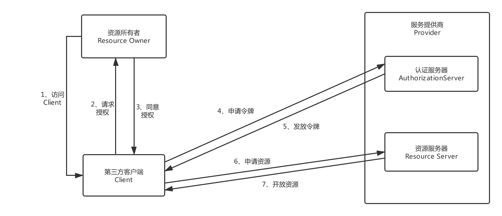
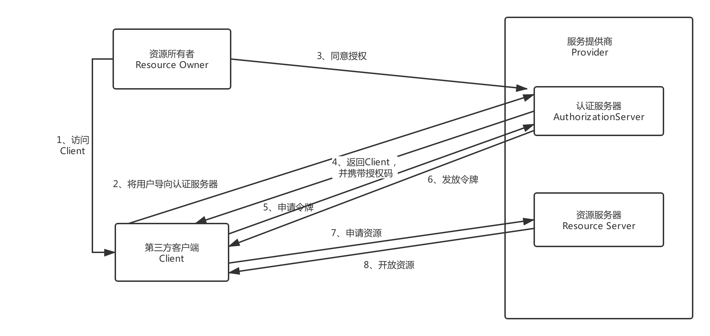
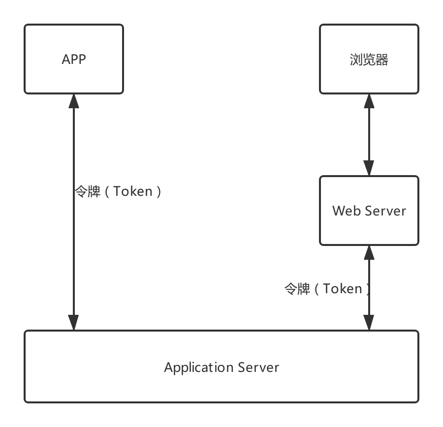

# Spring Security

学习Spring Security权限管理

## Spring Security基本原理

## Spring Security认证流程

## 过滤器链

## 过滤器

## 图片验证码

#### 重构

1、验证码基本参数可配置

请求级配置 -> 应用级配置 -> 默认配置

2、验证码拦截的接口可配置

3、验证码的生成逻辑可配置

## OAuth

#### 流程

#### 授权模式

也就是第3步有以下几种方式实现：

授权码模式（authorization code）

简化模式（implicit）

密码模式（resource owner password credentials）

客户端模式（client credentials）

#### 授权码模式流程

## Spring Security OAuth

#### 认证图

#### 使用session存在的问题

开发繁琐

安全性和客户体验差

有些前端技术不支持Cookie，如小程序